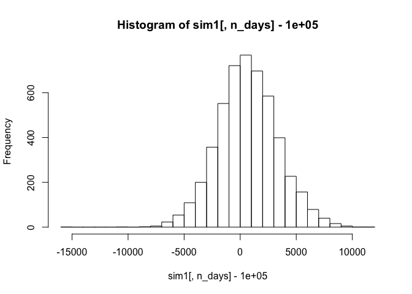

Exploratory Analysis
====================

    Votes = read.csv('georgia2000.csv', header=TRUE)
    summary(Votes)

    ##       county       ballots           votes            equip   
    ##  APPLING :  1   Min.   :   881   Min.   :   832   LEVER  :74  
    ##  ATKINSON:  1   1st Qu.:  3694   1st Qu.:  3506   OPTICAL:66  
    ##  BACON   :  1   Median :  6712   Median :  6299   PAPER  : 2  
    ##  BAKER   :  1   Mean   : 16926   Mean   : 16331   PUNCH  :17  
    ##  BALDWIN :  1   3rd Qu.: 12251   3rd Qu.: 11846               
    ##  BANKS   :  1   Max.   :280975   Max.   :263211               
    ##  (Other) :153                                                 
    ##       poor            urban           atlanta            perAA       
    ##  Min.   :0.0000   Min.   :0.0000   Min.   :0.00000   Min.   :0.0000  
    ##  1st Qu.:0.0000   1st Qu.:0.0000   1st Qu.:0.00000   1st Qu.:0.1115  
    ##  Median :0.0000   Median :0.0000   Median :0.00000   Median :0.2330  
    ##  Mean   :0.4528   Mean   :0.2642   Mean   :0.09434   Mean   :0.2430  
    ##  3rd Qu.:1.0000   3rd Qu.:1.0000   3rd Qu.:0.00000   3rd Qu.:0.3480  
    ##  Max.   :1.0000   Max.   :1.0000   Max.   :1.00000   Max.   :0.7650  
    ##                                                                      
    ##       gore             bush       
    ##  Min.   :   249   Min.   :   271  
    ##  1st Qu.:  1386   1st Qu.:  1804  
    ##  Median :  2326   Median :  3597  
    ##  Mean   :  7020   Mean   :  8929  
    ##  3rd Qu.:  4430   3rd Qu.:  7468  
    ##  Max.   :154509   Max.   :140494  
    ## 

    Votes$undercount = Votes$ballots - Votes$votes
    Votes$pctunder = Votes$undercount/Votes$ballots
    summary(Votes$pctunder)

    ##    Min. 1st Qu.  Median    Mean 3rd Qu.    Max. 
    ## 0.00000 0.02779 0.03983 0.04379 0.05647 0.18810

    boxplot(pctunder~equip, data=Votes)

We can see that, for the most part, the equipment tended to produce
similar rates of undercounting for all 4 of the equipment systems.
However, the only 2 counties that witnessed undercounting rates
significantly higher than 10% (at 14.96% and 18.81%) both used the
optical equipment to tally votes.

    t1 = xtabs(~poor + equip, data=Votes)
    t1

    ##     equip
    ## poor LEVER OPTICAL PAPER PUNCH
    ##    0    29      48     0    10
    ##    1    45      18     2     7

    p1 = prop.table(t1, margin=1)
    p1

    ##     equip
    ## poor      LEVER    OPTICAL      PAPER      PUNCH
    ##    0 0.33333333 0.55172414 0.00000000 0.11494253
    ##    1 0.62500000 0.25000000 0.02777778 0.09722222

    relrisk = p1[1,2]/p1[2,2] # relative risk for using optical
    relrisk

    ## [1] 2.206897

The relative risk shows that counties that were not categorized as
having increased poverty levels were much more likely to use the optical
voting equipment than those counties which did fit into this
characterization.

    plot(Votes$perAA, Votes$equip)

    lm.fit = lm(perAA~equip, data=Votes)
    summary(lm.fit)

    ## 
    ## Call:
    ## lm(formula = perAA ~ equip, data = Votes)
    ## 
    ## Residuals:
    ##      Min       1Q   Median       3Q      Max 
    ## -0.29547 -0.11914 -0.02524  0.10786  0.48876 
    ## 
    ## Coefficients:
    ##              Estimate Std. Error t value Pr(>|t|)    
    ## (Intercept)   0.27624    0.01818  15.194  < 2e-16 ***
    ## equipOPTICAL -0.09020    0.02648  -3.406 0.000839 ***
    ## equipPAPER    0.14326    0.11208   1.278 0.203099    
    ## equipPUNCH    0.02223    0.04207   0.528 0.597981    
    ## ---
    ## Signif. codes:  0 '***' 0.001 '**' 0.01 '*' 0.05 '.' 0.1 ' ' 1
    ## 
    ## Residual standard error: 0.1564 on 155 degrees of freedom
    ## Multiple R-squared:  0.09768,    Adjusted R-squared:  0.08022 
    ## F-statistic: 5.593 on 3 and 155 DF,  p-value: 0.001143

We can also see that the percentage of African Americans in any given
county does not visually appear to be correlated with the type of
equipment used. When running a multiple regression, the model suggests
that counties using optical equipment tend to have a lower percentage of
African Americans.

Bootstrapping
=============

    library(mosaic)

    ## Loading required package: car
    ## Loading required package: dplyr
    ## 
    ## Attaching package: 'dplyr'
    ## 
    ## The following objects are masked from 'package:stats':
    ## 
    ##     filter, lag
    ## 
    ## The following objects are masked from 'package:base':
    ## 
    ##     intersect, setdiff, setequal, union
    ## 
    ## Loading required package: lattice
    ## Loading required package: ggplot2
    ## Loading required package: mosaicData
    ## 
    ## Attaching package: 'mosaic'
    ## 
    ## The following objects are masked from 'package:dplyr':
    ## 
    ##     count, do, tally
    ## 
    ## The following object is masked from 'package:car':
    ## 
    ##     logit
    ## 
    ## The following objects are masked from 'package:stats':
    ## 
    ##     binom.test, cor, cov, D, fivenum, IQR, median, prop.test,
    ##     quantile, sd, t.test, var
    ## 
    ## The following objects are masked from 'package:base':
    ## 
    ##     max, mean, min, prod, range, sample, sum

    library(fImport)

    ## Loading required package: timeDate
    ## Loading required package: timeSeries

    library(foreach)

    set.seed(48)

    mystocks = c("SPY", "TLT", "LQD", "EEM", "VNQ")
    myprices = yahooSeries(mystocks, from='2010-08-05', to='2015-08-05')

    YahooPricesToReturns = function(series) {
      mycols = grep('Adj.Close', colnames(series))
        closingprice = series[,mycols]
        N = nrow(closingprice)
        percentreturn = as.data.frame(closingprice[2:N,]) / as.data.frame(closingprice[1:(N-1),]) - 1
        mynames = strsplit(colnames(percentreturn), '.', fixed=TRUE)
        mynames = lapply(mynames, function(x) return(paste0(x[1], ".PctReturn")))
        colnames(percentreturn) = mynames
        as.matrix(na.omit(percentreturn))
    }

    myreturns = YahooPricesToReturns(myprices)

    pairs(myreturns)

    cor(myreturns)

    ##               SPY.PctReturn TLT.PctReturn LQD.PctReturn EEM.PctReturn
    ## SPY.PctReturn     1.0000000    -0.5403138  -0.118985945   0.838300047
    ## TLT.PctReturn    -0.5403138     1.0000000   0.731988873  -0.429500069
    ## LQD.PctReturn    -0.1189859     0.7319889   1.000000000  -0.006538328
    ## EEM.PctReturn     0.8383000    -0.4295001  -0.006538328   1.000000000
    ## VNQ.PctReturn     0.7732692    -0.2772329   0.117120385   0.689737690
    ##               VNQ.PctReturn
    ## SPY.PctReturn     0.7732692
    ## TLT.PctReturn    -0.2772329
    ## LQD.PctReturn     0.1171204
    ## EEM.PctReturn     0.6897377
    ## VNQ.PctReturn     1.0000000

    myexpected = c(mean(myreturns[,1]),
                   mean(myreturns[,2]),
                   mean(myreturns[,3]),
                   mean(myreturns[,4]),
                   mean(myreturns[,5]))

    riskfree = myexpected[2]

    myexcess = matrix(0, nrow(myreturns), ncol(myreturns))

    for(i in 1:nrow(myreturns)) {
      for (j in 1:ncol(myreturns)) {
        myexcess[i,j] = myreturns[i,j] - riskfree
      }
    }

    mybeta2 = cov(myexcess[,2], myexcess[,1])/var(myexcess[,1])
    mybeta2

    ## [1] -0.5647879

    mybeta3 = cov(myexcess[,3], myexcess[,1])/var(myexcess[,1])
    mybeta3

    ## [1] -0.04562044

    mybeta4 = cov(myexcess[,4], myexcess[,1])/var(myexcess[,1])
    mybeta4

    ## [1] 1.231518

    mybeta5 = cov(myexcess[,5], myexcess[,1])/var(myexcess[,1])
    mybeta5

    ## [1] 0.9523014

Portfolio 1 - 20% of each asset
-------------------------------

    totalwealth = 100000
    weights1 = c(0.2, 0.2, 0.2, 0.2, 0.2)
    holdings = weights1 * totalwealth
    n_days = 20

    sim1 = foreach(i=1:5000, .combine='rbind') %do% {
      totalwealth = 100000
        weights = c(0.2, 0.2, 0.2, 0.2, 0.2)
        holdings = weights * totalwealth
        wealthtracker = rep(0, n_days)
        for(today in 1:n_days) {
            return.today = resample(myreturns, 1, orig.ids=FALSE)
            holdings = holdings + holdings*return.today
            totalwealth = sum(holdings)
            wealthtracker[today] = totalwealth
        holdings = weights * totalwealth
        }
        wealthtracker
    }

    hist(sim1[,n_days]- 100000, 25)

    quantile(sim1[,n_days], 0.05) - 100000

    ##        5% 
    ## -3664.299

    quantile(sim1[,n_days], 0.5) - 100000

    ##      50% 
    ## 616.1865

    quantile(sim1[,n_days], 0.95) - 100000

    ##      95% 
    ## 5208.725

This balanced portfolio has a 5% value-at-risk of $3,664.30. On average,
it will make about $616.19, and in the best 5% of simulations, it made
over $5,208.73.

Portfolio 2 - Safe
------------------

40% treasury bonds  
20% corporate bonds  
10% real estate  
30% S&P 500

    totalwealth = 100000
    weights1 = c(0.3, 0.4, 0.2, 0.0, 0.1)
    holdings = weights1 * totalwealth
    n_days = 20

    sim1 = foreach(i=1:5000, .combine='rbind') %do% {
      totalwealth = 100000
      weights = c(0.3, 0.4, 0.2, 0.0, 0.1)
        holdings = weights * totalwealth
        wealthtracker = rep(0, n_days)
        for(today in 1:n_days) {
            return.today = resample(myreturns, 1, orig.ids=FALSE)
            holdings = holdings + holdings*return.today
            totalwealth = sum(holdings)
            wealthtracker[today] = totalwealth
        holdings = weights * totalwealth
        }
        wealthtracker
    }

    hist(sim1[,n_days]- 100000, 25)

    quantile(sim1[,n_days], 0.05) - 100000

    ##       5% 
    ## -2409.02

    quantile(sim1[,n_days], 0.5) - 100000

    ##      50% 
    ## 840.8641

    quantile(sim1[,n_days], 0.95) - 100000

    ##    95% 
    ## 4029.5

This safer portfolio has a 5% value-at-risk of just $2,409.02. However,
we are also sacrificing the upside. On average, it had a 20-day return
of $840.86, but the top 5% of simulations produced returns over
$4,029.50.

Portfolio 3 - Aggressive
------------------------

20% S&P 500  
80% emerging markets

    totalwealth = 100000
    weights1 = c(0.2, 0.0, 0.0, 0.8, 0.0)
    holdings = weights1 * totalwealth
    n_days = 20

    sim1 = foreach(i=1:5000, .combine='rbind') %do% {
      totalwealth = 100000
      weights = c(0.2, 0.0, 0.0, 0.8, 0.0)
      holdings = weights * totalwealth
        wealthtracker = rep(0, n_days)
        for(today in 1:n_days) {
            return.today = resample(myreturns, 1, orig.ids=FALSE)
            holdings = holdings + holdings*return.today
            totalwealth = sum(holdings)
            wealthtracker[today] = totalwealth
        holdings = weights * totalwealth
        }
        wealthtracker
    }

    hist(sim1[,n_days]- 100000, 25)

    quantile(sim1[,n_days], 0.05) - 100000

    ##        5% 
    ## -8869.834

    quantile(sim1[,n_days], 0.5) - 100000

    ##      50% 
    ## 374.3237

    quantile(sim1[,n_days], 0.95) - 100000

    ##      95% 
    ## 9792.663

This very risky portfolio has the chance to make the most money.
However, it also has the chance to lose big, with a 5% value-at-risk of
$8,869.83. It actually did the worst on average, with an average gain of
$374.32. The aggressiveness paid off in the best 5% of scenarios,
though, generating over $9,792.66 in returns.

Clustering and PCA
==================

    library(cluster)
    library(fpc)

    Wine = read.csv('wine.csv', header=TRUE)

    wine_chem = Wine[,1:11]
    wine_scaled = scale(wine_chem, center=TRUE, scale=TRUE)
    mu = attr(wine_scaled,"scaled:center")
    sigma = attr(wine_scaled,"scaled:scale")

    summary(wine_scaled)

    ##  fixed.acidity     volatile.acidity   citric.acid       residual.sugar   
    ##  Min.   :-2.6344   Min.   :-1.5772   Min.   :-2.19266   Min.   :-1.0180  
    ##  1st Qu.:-0.6289   1st Qu.:-0.6661   1st Qu.:-0.47230   1st Qu.:-0.7657  
    ##  Median :-0.1661   Median :-0.3017   Median :-0.05941   Median :-0.5135  
    ##  Mean   : 0.0000   Mean   : 0.0000   Mean   : 0.00000   Mean   : 0.0000  
    ##  3rd Qu.: 0.3739   3rd Qu.: 0.3665   3rd Qu.: 0.49111   3rd Qu.: 0.5584  
    ##  Max.   : 6.6989   Max.   : 7.5338   Max.   : 9.23057   Max.   :12.6858  
    ##    chlorides       free.sulfur.dioxide total.sulfur.dioxide
    ##  Min.   :-1.3425   Min.   :-1.66345    Min.   :-1.9416     
    ##  1st Qu.:-0.5148   1st Qu.:-0.76202    1st Qu.:-0.6855     
    ##  Median :-0.2579   Median :-0.08594    Median : 0.0399     
    ##  Mean   : 0.0000   Mean   : 0.00000    Mean   : 0.0000     
    ##  3rd Qu.: 0.2559   3rd Qu.: 0.59014    3rd Qu.: 0.7122     
    ##  Max.   :15.8410   Max.   :14.56245    Max.   : 5.7368     
    ##     density               pH             sulphates          alcohol       
    ##  Min.   :-2.53000   Min.   :-3.10038   Min.   :-2.0918   Min.   :-2.0892  
    ##  1st Qu.:-0.78589   1st Qu.:-0.67481   1st Qu.:-0.6805   1st Qu.:-0.8316  
    ##  Median : 0.06448   Median :-0.05287   Median :-0.1429   Median :-0.1608  
    ##  Mean   : 0.00000   Mean   : 0.00000   Mean   : 0.0000   Mean   : 0.0000  
    ##  3rd Qu.: 0.76479   3rd Qu.: 0.63126   3rd Qu.: 0.4619   3rd Qu.: 0.6776  
    ##  Max.   :14.76765   Max.   : 4.92265   Max.   : 9.8701   Max.   : 3.6959

PCA
---

    pc.wine = prcomp(wine_scaled, scale=TRUE)
    summary(pc.wine)

    ## Importance of components:
    ##                           PC1    PC2    PC3     PC4     PC5     PC6
    ## Standard deviation     1.7407 1.5792 1.2475 0.98517 0.84845 0.77930
    ## Proportion of Variance 0.2754 0.2267 0.1415 0.08823 0.06544 0.05521
    ## Cumulative Proportion  0.2754 0.5021 0.6436 0.73187 0.79732 0.85253
    ##                            PC7     PC8     PC9   PC10    PC11
    ## Standard deviation     0.72330 0.70817 0.58054 0.4772 0.18119
    ## Proportion of Variance 0.04756 0.04559 0.03064 0.0207 0.00298
    ## Cumulative Proportion  0.90009 0.94568 0.97632 0.9970 1.00000

    plot(pc.wine)

    loadings = pc.wine$rotation
    scores = pc.wine$x
    qplot(scores[,1], scores[,2], color=Wine$color, xlab='Component 1', ylab='Component 2')

Above, we see that the first 2 principal components separate the wines
into red and white pretty accurately.

    qplot(scores[,1], scores[,2], color=Wine$quality, xlab='Component 1', ylab='Component 2')

However, the distinction between the qualities of the wine is much more
subtle. However, we can see a slight trend in the data points, such that
it seems the wines toward the bottom-right of the chart have a tendency
to score better than the wines at the top-left of the chart. However,
this is not without many exceptions.

    o1 = order(loadings[,1])
    colnames(wine_scaled)[head(o1,4)]

    ## [1] "volatile.acidity" "sulphates"        "chlorides"       
    ## [4] "fixed.acidity"

    colnames(wine_scaled)[tail(o1,4)]

    ## [1] "citric.acid"          "residual.sugar"       "free.sulfur.dioxide" 
    ## [4] "total.sulfur.dioxide"

    o2 = order(loadings[,2])
    colnames(wine_scaled)[head(o2,4)]

    ## [1] "alcohol"              "pH"                   "free.sulfur.dioxide" 
    ## [4] "total.sulfur.dioxide"

    colnames(wine_scaled)[tail(o2,4)]

    ## [1] "chlorides"      "residual.sugar" "fixed.acidity"  "density"

k-means
-------

    cluster_chem = kmeans(wine_scaled, centers = 2, n=50)
    plotcluster(wine_scaled, cluster_chem$cluster)

    qplot(color, density, data=Wine, color=factor(cluster_chem$cluster))

    table(Wine$color,cluster_chem$cluster)

    ##        
    ##            1    2
    ##   red     24 1575
    ##   white 4830   68

Here we can see that we can pretty accurately predict whether the wine
is red or white based on just this k-means clustering.

    cluster_chem = kmeans(wine_scaled, centers = 10, iter.max=30, n=50)
    qplot(color, volatile.acidity, data=Wine, color=factor(cluster_chem$cluster))

    plotcluster(wine_scaled, cluster_chem$cluster)

    table(Wine$quality,cluster_chem$cluster)

    ##    
    ##       1   2   3   4   5   6   7   8   9  10
    ##   3   4   1   4   0   1   2   2   3   7   6
    ##   4  61  23   6   7   2  23  14  18  50  12
    ##   5 395 308  68  70  19 187  68 364 254 405
    ##   6 468 132 121 161   7 438 490 376 234 409
    ##   7 118   8  56  90   1 210 408 101  42  45
    ##   8  20   0   6   8   0  32  93  17   4  13
    ##   9   0   0   0   0   0   0   4   1   0   0

However, we can see that the quality, as determined by the wine snobs,
seems relatively normally distributed among 10 clusters, indicating that
we cannot group the wines together based on their chemical makeup using
k-means in a way that tells us much of anything about how the quality
will be judged.

Market Segmentation
===================

Just using k-means did not produce very interpretable graphs, since all
features are measured in integers, so that no matter the axes, I was
only able to see a few of the thousands of points.

Therefore, I decided to combine PCA with k-means, in that I used the
k-means clusters to color the points on the qplot for PCA. This actually
turned out to be very powerful in terms of visually categorizing the
data.

    twitter.data = read.csv('social_marketing.csv', header=TRUE)
    twitter.data = twitter.data[,2:37]
    twitter.scaled = scale(twitter.data, center=TRUE, scale=TRUE)

    pc.twitter = prcomp(twitter.scaled, scale=TRUE)
    plot(pc.twitter)

    loadings = pc.twitter$rotation
    scores = pc.twitter$x
    # COLOR BY K-MEANS CLUSTER
    cluster_cat = kmeans(twitter.scaled, centers = 2, n=50)
    qplot(scores[,1], scores[,2], color=cluster_cat$cluster, xlab='Component 1', ylab='Component 2')

    cluster_cat$centers

    ##      chatter current_events     travel photo_sharing uncategorized
    ## 1  0.3610277      0.2410334  0.3016090     0.5252653     0.2654835
    ## 2 -0.1497640     -0.0999871 -0.1251155    -0.2178941    -0.1101297
    ##      tv_film sports_fandom   politics       food     family
    ## 1  0.3113561     0.6570520  0.3071378  0.7265849  0.6054227
    ## 2 -0.1291588    -0.2725628 -0.1274090 -0.3014069 -0.2511455
    ##   home_and_garden      music       news online_gaming   shopping
    ## 1       0.3111368  0.3735600  0.2922852     0.2452840  0.3856642
    ## 2      -0.1290679 -0.1549627 -0.1212477    -0.1017504 -0.1599838
    ##   health_nutrition college_uni sports_playing    cooking        eco
    ## 1        0.3560053   0.3212917      0.3995973  0.5511958  0.3834307
    ## 2       -0.1476805  -0.1332804     -0.1657637 -0.2286508 -0.1590573
    ##    computers   business   outdoors     crafts automotive        art
    ## 1  0.3738431  0.3649086  0.4097331  0.5148234  0.3069772  0.3196937
    ## 2 -0.1550801 -0.1513739 -0.1699683 -0.2135625 -0.1273424 -0.1326175
    ##     religion     beauty  parenting     dating     school personal_fitness
    ## 1  0.6972643  0.5889618  0.6918299  0.2945378  0.6943926        0.3940198
    ## 2 -0.2892439 -0.2443171 -0.2869896 -0.1221821 -0.2880527       -0.1634500
    ##      fashion small_business        spam       adult
    ## 1  0.5532926      0.3414175  0.03141542  0.06416821
    ## 2 -0.2295206     -0.1416291 -0.01303196 -0.02661869

The two segments break up nicely. However, it seems that the two groups
are essentially divided into people who tweet above average amounts
about everything, and those who tweet a below average amount about
everything. However, this does explain why the points on the right are
so close together, and the left is so spread out. There is only one way
to not talk about much of anything.

Let's try coloring with three clusters to get more information.

    cluster_cat = kmeans(twitter.scaled, centers = 3, n=50)
    qplot(scores[,1], scores[,2], color=cluster_cat$cluster, xlab='Component 1', ylab='Component 2')

    cluster_cat$centers

    ##      chatter current_events      travel photo_sharing uncategorized
    ## 1 -0.2279095     -0.1330528 -0.14968603   -0.30988447   -0.15584823
    ## 2 -0.0919489      0.1382864 -0.02094705   -0.07611764   -0.08317875
    ## 3  0.5565214      0.2527518  0.35068802    0.73831357    0.38818842
    ##       tv_film sports_fandom    politics        food      family
    ## 1 -0.15537651    -0.2796817 -0.14962782 -0.32452033 -0.26138618
    ## 2 -0.01700495     1.9833885 -0.09603981  1.79056159  1.42058933
    ## 3  0.36223903    -0.1048489  0.37877561  0.07030899  0.06475785
    ##   home_and_garden       music         news online_gaming    shopping
    ## 1      -0.1562601 -0.19238200 -0.129447630   -0.11027519 -0.24804189
    ## 2       0.1970453  0.04103381 -0.002397462    0.02452952 -0.01136432
    ## 3       0.2838196  0.42517845  0.297366176    0.24333730  0.57234449
    ##   health_nutrition college_uni sports_playing     cooking        eco
    ## 1      -0.20620155 -0.14753255     -0.1874304 -0.29298630 -0.2080663
    ## 2      -0.08707445 -0.03331184      0.1212156 -0.08247293  0.1833887
    ## 3       0.50497329  0.35040291      0.3837048  0.70200125  0.4076002
    ##    computers   business    outdoors     crafts automotive         art
    ## 1 -0.1830420 -0.1865640 -0.20869201 -0.2399432 -0.1455728 -0.15503359
    ## 2  0.1506281  0.1287350 -0.02189469  0.6729960  0.1770790  0.09140192
    ## 3  0.3626005  0.3788945  0.48618156  0.2966045  0.2668469  0.32071285
    ##     religion     beauty   parenting      dating      school
    ## 1 -0.3026726 -0.2776076 -0.30176763 -0.15248786 -0.30544373
    ## 2  2.2000711  0.2938062  2.05368962 -0.02317491  1.60783041
    ## 3 -0.1336267  0.5253696 -0.08068717  0.35794211  0.09529207
    ##   personal_fitness     fashion small_business         spam         adult
    ## 1      -0.22410839 -0.27991825    -0.17909400 -0.024043319 -0.0282179993
    ## 2      -0.03002355  0.01879561     0.08657414 -0.003389674  0.0007604057
    ## 3       0.52454361  0.63401423     0.37763114  0.056338678  0.0643400096

We can see that the quiet group remains over to the right, while the
active accounts have been split into two main groups and seem to be
divided in the direction of Component 2.

    cluster_cat = kmeans(twitter.scaled, centers = 4, n=50)
    qplot(scores[,1], scores[,2], color=cluster_cat$cluster, xlab='Component 1', ylab='Component 2')

    cluster_cat$centers

    ##        chatter current_events      travel photo_sharing uncategorized
    ## 1  0.552935923      0.2131389 -0.07591106    0.80308456    0.42114680
    ## 2 -0.207070703     -0.1213832 -0.22793847   -0.29685992   -0.15098266
    ## 3 -0.081998119      0.1209128 -0.10612678   -0.05440228   -0.07148329
    ## 4  0.001701624      0.1029249  1.76871362   -0.09203676   -0.03214014
    ##       tv_film sports_fandom   politics        food      family
    ## 1  0.36327227    -0.1767568 -0.1560535  0.06930782  0.04327329
    ## 2 -0.14989745    -0.3011879 -0.2751784 -0.33687659 -0.27177454
    ## 3 -0.01097394     2.0214691 -0.1987502  1.80894586  1.46187536
    ## 4  0.04374918     0.2073217  2.3758806  0.03564873  0.05836763
    ##   home_and_garden       music        news online_gaming     shopping
    ## 1       0.2698173  0.48853332 -0.11244228    0.25443030  0.582041621
    ## 2      -0.1558026 -0.19558459 -0.24485382   -0.10137316 -0.226012471
    ## 3       0.1734206  0.04591515 -0.07924156    0.02355572  0.008613081
    ## 4       0.1221193 -0.04486926  1.94155589   -0.02611189 -0.048786761
    ##   health_nutrition  college_uni sports_playing    cooking        eco
    ## 1       0.65904677  0.357686698     0.39796274  0.8802806  0.4186094
    ## 2      -0.22985726 -0.136246010    -0.19162911 -0.3112338 -0.2134898
    ## 3      -0.08561784 -0.032809002     0.13095540 -0.0773048  0.1819315
    ## 4      -0.11962029 -0.005959966     0.06981431 -0.1726156  0.1022832
    ##     computers   business    outdoors     crafts  automotive         art
    ## 1 -0.01605562  0.3098959  0.54166853  0.2566214  0.01985197  0.33161361
    ## 2 -0.24879784 -0.1929945 -0.23958436 -0.2360279 -0.21017683 -0.14433117
    ## 3  0.08005043  0.1165018 -0.02808759  0.6915247  0.16170668  0.09775462
    ## 4  1.54912167  0.3192108  0.18084686  0.1126088  1.12204261 -0.02794858
    ##      religion     beauty   parenting      dating     school
    ## 1 -0.16514743  0.6565506 -0.11297840  0.33315475  0.1005039
    ## 2 -0.30255523 -0.2900446 -0.31158266 -0.15797742 -0.3077875
    ## 3  2.22953328  0.3024467  2.10037879 -0.02625622  1.6298873
    ## 4 -0.03739118 -0.1450000  0.02602985  0.18894125 -0.0378785
    ##   personal_fitness    fashion small_business          spam       adult
    ## 1        0.6744921  0.7726597     0.29977972  0.0209962202  0.06192273
    ## 2       -0.2466332 -0.2895794    -0.16857614 -0.0120780268 -0.01256051
    ## 3       -0.0280779  0.0239498     0.08571906  0.0004799918  0.01238385
    ## 4       -0.1134978 -0.1451981     0.22171658  0.0232076149 -0.09111407

We can see a third group emerging from the active members. But what
would happen if we used the 2nd and 3rd principal components instead of
the 1st and 2nd? Could we possibly see those groups split up by more
than activity level?

    qplot(scores[,2], scores[,3], color=cluster_cat$cluster, xlab='Component 2', ylab='Component 3')

I like the result of this graph. Instead of focusing on the 1st
principal component, which mostly separates active accounts from
inactive accounts, we instead see the inactive accounts in the middle
(where we don't know much about their interests) with 3 main categories
of interest spiked out like spokes on a wheel, with little overlap. Four
clusters fits this data well for that reason: a nondescript center and
three categorizations of active users.

I have organized these three groups by their most common interests,
especially the ones that separate them from the other 2 groups. I then
tried to come up with a few labels that could describe this market
segment in order to help NutrientH20 understand its follower base.

1.  Teenagers, College Students, Young Adults:  
    chatter, photo sharing, shopping, music, college, sports playing,
    cooking, eco, beauty, outdoors, personal fitness, fashion,
    health/nutrition, tv/film, online gaming, art

2.  Suburban Parents, Rural, Senior Citizens:  
    family, food, sports fandom, crafts, religion, parenting, school

3.  Sophisticated, Independent, Career-Oriented, Hobbyists, Urban:  
    travel, politics, news, computers, automotive
