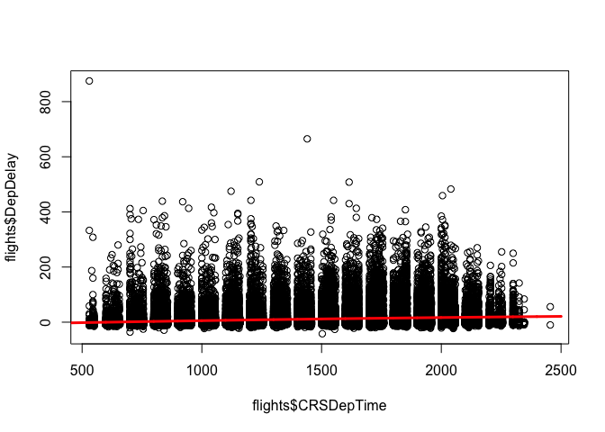
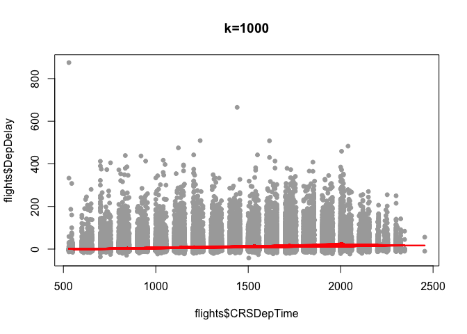

Flights at ABIA
===============

    set.seed(620)

    # flights at ABIA
    flights = read.csv('/Users/bengrisz/Documents/UT/Academic/Predictive2/STA380/data/ABIA.csv', header=TRUE)

    flights$Year <- NULL
    flights$FlightNum <- NULL
    flights$TailNum <- NULL
    flights$UniqueCarrier <- NULL
    flights$TaxiIn <- NULL
    flights$TaxiOut <- NULL
    flights$CancellationCode <- NULL

    flights$CRSDepTime[flights$CRSDepTime<300] <- 
          flights$CRSDepTime[flights$CRSDepTime<300] + 2400
    flights$CarrierDelay <- NULL
    flights$WeatherDelay <- NULL
    flights$NASDelay <- NULL
    flights$SecurityDelay <- NULL
    flights$LateAircraftDelay <- NULL

    flights$Month <- factor(flights$Month)
    flights$DayofMonth <- factor(flights$DayofMonth)

Due to the shape of the data, it looks like there could be a positive
correlation between delays and departure time, and it looks like there
could be a negative correlation between delays and
departure-time-squared. Thus I will try to fit `DepDelay` on a second
degree polynomial of `CRSDepTime`.

    plot(flights$CRSDepTime, flights$DepDelay)
    quad.fit = lm(DepDelay ~ poly(CRSDepTime, 2),data=flights)

    minutes = seq(400,2500,1)
    quad.pred = predict(quad.fit,data.frame(CRSDepTime=minutes))

    plot(flights$CRSDepTime, flights$DepDelay)
    lines(minutes, quad.pred, col="red", lwd=3)

This does not capture the curve I imagined when looking at the shape of
the data points. However, it does hint at a slightly upward slope, such
that the later in the day a flight is, the more likely it is to be
delayed.

Next I want to try k-Nearest Neighbors to see if it describes some of
the shape of the data better than the linear model, or at least to see
if it confirms the positive correlation between departure time and
delays.

    library(kknn)
    train = data.frame(flights$CRSDepTime, flights$DepDelay)
    colnames(train) <- c("DepTime", "Delay")
    test = data.frame(flights$CRSDepTime, flights$DepDelay)
    colnames(test) <- c("DepTime", "Delay")
    ind = order(test[,1])
    test = test[ind,]
    near = kknn(Delay~DepTime, train, test, k=1000, kernel="rectangular")
    plot(flights$CRSDepTime, flights$DepDelay, main=paste("k=1000"), 
         pch=19,cex=0.8,col="darkgray")
    lines(test[ind,1],near$fitted[ind],col=2,lwd=2)

We can see that the k-Nearest Neighbors algorithm finds a similar upward
trend, such that it is likely the delays are worse on average the later
it gets in the day. This follows intuition, as delays earlier in the day
can lead to delays in later flights. While all flights in the day are
just as likely to be delayed for the first time at any time, the total
should increase as delays later in the day that were caused by earlier
flights start to add on to the random delays.

Author Attribution
==================

    library(tm)

    ## Loading required package: NLP

    readerPlain = function(fname){
      readPlain(elem=list(content=readLines(fname)), 
                id=fname, language='en') }
    author_dirs = Sys.glob('/Users/bengrisz/Documents/UT/Academic/Predictive2/STA380/data/ReutersC50/C50train/*')

    file_list = NULL
    labels = NULL
    for(author in author_dirs) {
      author_name = substring(author, first=84)
      files_to_add = Sys.glob(paste0(author, '/*.txt'))
      file_list = append(file_list, files_to_add)
      labels = append(labels, rep(author_name, length(files_to_add)))
    }

    all_docs = lapply(file_list, readerPlain) 
    names(all_docs) = file_list
    names(all_docs) = sub('.txt', '', names(all_docs))

    train_corpus = Corpus(VectorSource(all_docs))
    names(train_corpus) = file_list

    train_corpus = tm_map(train_corpus, content_transformer(tolower))
    train_corpus = tm_map(train_corpus, content_transformer(removeNumbers))
    train_corpus = tm_map(train_corpus, content_transformer(removePunctuation))
    train_corpus = tm_map(train_corpus, content_transformer(stripWhitespace))
    train_corpus = tm_map(train_corpus, content_transformer(removeWords), stopwords("en"))

    DTM_train = DocumentTermMatrix(train_corpus)
    DTM_train = removeSparseTerms(DTM_train, .99)
    DTM_train

    ## <<DocumentTermMatrix (documents: 2500, terms: 3325)>>
    ## Non-/sparse entries: 376957/7935543
    ## Sparsity           : 95%
    ## Maximal term length: 20
    ## Weighting          : term frequency (tf)

    X_train = as.matrix(DTM_train)

    smooth_count = 1/nrow(X_train)
    w_all = rowsum(X_train + smooth_count, labels)
    w_all = w_all/sum(w_all)
    w_all = log(w_all)

Above, I have read in the data and used the `tm` library to quickly
produce a document term matrix for the test data. Next, I created
weights per author for each word according to the corpus. Below, I
created a similar matrix for the test data, ensuring that the new matrix
would have the exact same columns as the training data.

    author_dirs = Sys.glob('/Users/bengrisz/Documents/UT/Academic/Predictive2/STA380/data/ReutersC50/C50test/*')

    file_list = NULL
    test_labels = NULL
    author_names = NULL
    for(author in author_dirs) {
      author_name = substring(author, first=83)
      author_names = append(author_names, author_name)
      files_to_add = Sys.glob(paste0(author, '/*.txt'))
      file_list = append(file_list, files_to_add)
      test_labels = append(test_labels, rep(author_name, length(files_to_add)))
    }

    all_docs = lapply(file_list, readerPlain) 
    names(all_docs) = file_list
    names(all_docs) = sub('.txt', '', names(all_docs))

    test_corpus = Corpus(VectorSource(all_docs))
    names(test_corpus) = file_list

    test_corpus = tm_map(test_corpus, content_transformer(tolower))
    test_corpus = tm_map(test_corpus, content_transformer(removeNumbers))
    test_corpus = tm_map(test_corpus, content_transformer(removePunctuation))
    test_corpus = tm_map(test_corpus, content_transformer(stripWhitespace))
    test_corpus = tm_map(test_corpus, content_transformer(removeWords), stopwords("en"))

    DTM_test = DocumentTermMatrix(test_corpus, list(dictionary=colnames(DTM_train)))
    DTM_test

    ## <<DocumentTermMatrix (documents: 2500, terms: 3325)>>
    ## Non-/sparse entries: 375822/7936678
    ## Sparsity           : 95%
    ## Maximal term length: 20
    ## Weighting          : term frequency (tf)

    X_test = as.matrix(DTM_test)

In order to run Naive Bayes, we compare the sum of the products (dot
product) of all the weights for each author's use of a word times each
word's frequency in the document we are trying to classify. This amounts
to the same as comparing the probabilities. We select the maximum score
using this method to determine which author we will say was likely the
author of the document.

    predictions = NULL
    for (i in 1:nrow(X_test)) {
      # get maximum Naive Bayes log probabilities
      max = -(Inf)
      author = NULL
      for (j in 1:nrow(w_all)) {
        result = sum(w_all[j,]*X_test[i,])
        if (result > max) {
          max = result
          author = rownames(w_all)[j]
        }
      }
      predictions = append(predictions, author)
    }

    predict_results = table(test_labels,predictions)

The predictions seem relatively accurate at first glance considering we
are selecting from 50 classifications. I did not print them out as the
results are unwieldy, but below is a summary of the highlights:

Many predicted: Alexander Smith, Jane Macartney

Most accurate: Fumiko Fujisaki (48 correct, 2 docs wrongly attributed),
Jim Gilchrist (48 correct, 2 docs wrongly attributed), Lynnley Browning
(50 correct, 12 wrongly attributed), Roger Fillion (40 correct, 1
wrongly attributed)

Least predicted: Edna Fernandes (10 correct, 2 wrongly attributed), Tan
Eelyn (1 correct, 1 wrongly attributed)

Most broad predictions: Samuel Perry was predicted for docs by 17
different authors, Sarah Davidson predicted for docs by 28 diff. authors

Most common misclassifications: Tan Eelyn for Peter Humphrey (33), Scott
Hillis for Jane Macartney (36), Benjamin Kang Lim for Jane Macartney
(24), Alan Crosby for John Mastrini (20), Jon Lopatka for John Mastrini
(20), David Lowder for Todd Nissen (24)

    correct = NULL
    for (i in 1:nrow(predict_results)) {
      correct = append(correct, predict_results[i, i])
    }

    correct_by_author = data.frame(correct, row.names = author_names)
    correct_by_author

    ##                  correct
    ## aronPressman          30
    ## lanCrosby              1
    ## lexanderSmith         36
    ## enjaminKangLim        21
    ## ernardHickey          32
    ## radDorfman            30
    ## arrenSchuettler       17
    ## avidLawder            43
    ## dnaFernandes          39
    ## ricAuchard            13
    ## umikoFujisaki         27
    ## rahamEarnshaw         26
    ## eatherScoffield       45
    ## anLopatka             11
    ## aneMacartney           5
    ## imGilchrist           10
    ## oWinterbottom         17
    ## oeOrtiz               41
    ## ohnMastrini           10
    ## onathanBirt           21
    ## arlPenhaul            44
    ## eithWeir              26
    ## evinDrawbaugh         35
    ## evinMorrison          41
    ## irstinRidley          40
    ## ouroshKarimkhany      46
    ## ydiaZajc              36
    ## ynneO'Donnell         11
    ## ynnleyBrowning        36
    ## arcelMichelson        46
    ## arkBendeich           32
    ## artinWolk             33
    ## atthewBunce           22
    ## ichaelConnor          42
    ## ureDickie             41
    ## ickLouth              21
    ## atriciaCommins        19
    ## eterHumphrey          40
    ## ierreTran             29
    ## obinSidel             30
    ## ogerFillion           31
    ## amuelPerry            39
    ## arahDavison           39
    ## cottHillis            36
    ## imonCowell            28
    ## anEeLyn               48
    ## heresePoletti         19
    ## imFarrand             31
    ## oddNissen             40
    ## illiamKazer           50

    sum(correct_by_author)/2500

    ## [1] 0.6024

Using the Naive Bayes classification method, we got a 60.24% rate of
success identifying the correct author for a document.

Next, I wanted to try Random Forest, because I think that finding the
right words to split on would greatly increase prediction accuracy. The
first few times I ran it, it crashed my computer because the algorithm
has way too much complexity to use on a model with 3325 features.
Therefore I had to reduce the `mtry` to 6.

    library(randomForest)

    ## randomForest 4.6-10
    ## Type rfNews() to see new features/changes/bug fixes.

    rf.fit = randomForest(x = X_train, y = as.factor(labels), mtry=6, ntree=200)
    rf.pred = predict(rf.fit, data=X_test)
    rf_results = table(test_labels, rf.pred)
    rf_correct = NULL
    for (i in 1:nrow(rf_results)) {
      rf_correct = append(rf_correct, rf_results[i, i])
    }

    rf_correct_by_author = data.frame(rf_correct, row.names = author_names)
    rf_correct_by_author

    ##                  rf_correct
    ## aronPressman             27
    ## lanCrosby                21
    ## lexanderSmith            27
    ## enjaminKangLim           41
    ## ernardHickey             25
    ## radDorfman               46
    ## arrenSchuettler          44
    ## avidLawder               45
    ## dnaFernandes             43
    ## ricAuchard               43
    ## umikoFujisaki            40
    ## rahamEarnshaw            32
    ## eatherScoffield          45
    ## anLopatka                45
    ## aneMacartney             16
    ## imGilchrist              32
    ## oWinterbottom            48
    ## oeOrtiz                  41
    ## ohnMastrini              35
    ## onathanBirt              38
    ## arlPenhaul               42
    ## eithWeir                 35
    ## evinDrawbaugh            35
    ## evinMorrison             33
    ## irstinRidley             35
    ## ouroshKarimkhany         43
    ## ydiaZajc                 38
    ## ynneO'Donnell            20
    ## ynnleyBrowning           42
    ## arcelMichelson           50
    ## arkBendeich              38
    ## artinWolk                33
    ## atthewBunce              44
    ## ichaelConnor             32
    ## ureDickie                43
    ## ickLouth                 39
    ## atriciaCommins           39
    ## eterHumphrey             45
    ## ierreTran                34
    ## obinSidel                37
    ## ogerFillion              45
    ## amuelPerry               42
    ## arahDavison              32
    ## cottHillis               43
    ## imonCowell               28
    ## anEeLyn                  50
    ## heresePoletti            15
    ## imFarrand                47
    ## oddNissen                48
    ## illiamKazer              50

    sum(rf_correct_by_author)/2500

    ## [1] 0.7564

Using the Random Forest model, I got a 77.24% rate of success
identifying the correct author for a document.

I prefer the Naive Bayes simply because it is more interpretable. We can
see the different likelihoods for each word and possibly say something
about their speech patterns of choice of words. Random Forest may be a
more accurate predictor, but does not give us the same clear-cut
inprebetability. Also, it is likely that increasing mtry would increase
the accuracy of Random Forest, but it is computationally infeasible to
make it too large, which is another reason why it is not preferable to
Naive Bayes.

Practice with Association Rule Mining
=====================================

    library(arules)

    ## Loading required package: Matrix
    ## 
    ## Attaching package: 'arules'
    ## 
    ## The following object is masked from 'package:tm':
    ## 
    ##     inspect
    ## 
    ## The following objects are masked from 'package:base':
    ## 
    ##     %in%, write

    groceries <- read.transactions("/Users/bengrisz/Documents/UT/Academic/Predictive2/STA380/data/groceries.txt", format = 'basket', sep = ',')
    grocrules <- apriori(groceries, parameter=list(support=.005, confidence=.5, maxlen=8))

    ## 
    ## Parameter specification:
    ##  confidence minval smax arem  aval originalSupport support minlen maxlen
    ##         0.5    0.1    1 none FALSE            TRUE   0.005      1      8
    ##  target   ext
    ##   rules FALSE
    ## 
    ## Algorithmic control:
    ##  filter tree heap memopt load sort verbose
    ##     0.1 TRUE TRUE  FALSE TRUE    2    TRUE
    ## 
    ## apriori - find association rules with the apriori algorithm
    ## version 4.21 (2004.05.09)        (c) 1996-2004   Christian Borgelt
    ## set item appearances ...[0 item(s)] done [0.00s].
    ## set transactions ...[169 item(s), 9835 transaction(s)] done [0.00s].
    ## sorting and recoding items ... [120 item(s)] done [0.00s].
    ## creating transaction tree ... done [0.00s].
    ## checking subsets of size 1 2 3 4 done [0.00s].
    ## writing ... [120 rule(s)] done [0.00s].
    ## creating S4 object  ... done [0.00s].

    inspect(grocrules)

    ##     lhs                           rhs                    support confidence     lift
    ## 1   {baking powder}            => {whole milk}       0.009252669  0.5229885 2.046793
    ## 2   {oil,                                                                           
    ##      other vegetables}         => {whole milk}       0.005083884  0.5102041 1.996760
    ## 3   {onions,                                                                        
    ##      root vegetables}          => {other vegetables} 0.005693950  0.6021505 3.112008
    ## 4   {onions,                                                                        
    ##      whole milk}               => {other vegetables} 0.006609049  0.5462185 2.822942
    ## 5   {hygiene articles,                                                              
    ##      other vegetables}         => {whole milk}       0.005185562  0.5425532 2.123363
    ## 6   {other vegetables,                                                              
    ##      sugar}                    => {whole milk}       0.006304016  0.5849057 2.289115
    ## 7   {long life bakery product,                                                      
    ##      other vegetables}         => {whole milk}       0.005693950  0.5333333 2.087279
    ## 8   {cream cheese ,                                                                 
    ##      yogurt}                   => {whole milk}       0.006609049  0.5327869 2.085141
    ## 9   {chicken,                                                                       
    ##      root vegetables}          => {other vegetables} 0.005693950  0.5233645 2.704829
    ## 10  {chicken,                                                                       
    ##      root vegetables}          => {whole milk}       0.005998983  0.5514019 2.157993
    ## 11  {chicken,                                                                       
    ##      rolls/buns}               => {whole milk}       0.005287239  0.5473684 2.142208
    ## 12  {coffee,                                                                        
    ##      yogurt}                   => {whole milk}       0.005083884  0.5208333 2.038359
    ## 13  {frozen vegetables,                                                             
    ##      root vegetables}          => {other vegetables} 0.006100661  0.5263158 2.720082
    ## 14  {frozen vegetables,                                                             
    ##      root vegetables}          => {whole milk}       0.006202339  0.5350877 2.094146
    ## 15  {frozen vegetables,                                                             
    ##      rolls/buns}               => {whole milk}       0.005083884  0.5000000 1.956825
    ## 16  {frozen vegetables,                                                             
    ##      other vegetables}         => {whole milk}       0.009659380  0.5428571 2.124552
    ## 17  {beef,                                                                          
    ##      yogurt}                   => {whole milk}       0.006100661  0.5217391 2.041904
    ## 18  {beef,                                                                          
    ##      rolls/buns}               => {whole milk}       0.006812405  0.5000000 1.956825
    ## 19  {curd,                                                                          
    ##      whipped/sour cream}       => {whole milk}       0.005897306  0.5631068 2.203802
    ## 20  {curd,                                                                          
    ##      tropical fruit}           => {yogurt}           0.005287239  0.5148515 3.690645
    ## 21  {curd,                                                                          
    ##      tropical fruit}           => {other vegetables} 0.005287239  0.5148515 2.660833
    ## 22  {curd,                                                                          
    ##      tropical fruit}           => {whole milk}       0.006507372  0.6336634 2.479936
    ## 23  {curd,                                                                          
    ##      root vegetables}          => {other vegetables} 0.005490595  0.5046729 2.608228
    ## 24  {curd,                                                                          
    ##      root vegetables}          => {whole milk}       0.006202339  0.5700935 2.231146
    ## 25  {curd,                                                                          
    ##      yogurt}                   => {whole milk}       0.010066090  0.5823529 2.279125
    ## 26  {curd,                                                                          
    ##      rolls/buns}               => {whole milk}       0.005897306  0.5858586 2.292845
    ## 27  {curd,                                                                          
    ##      other vegetables}         => {whole milk}       0.009862735  0.5739645 2.246296
    ## 28  {pork,                                                                          
    ##      root vegetables}          => {other vegetables} 0.007015760  0.5149254 2.661214
    ## 29  {pork,                                                                          
    ##      root vegetables}          => {whole milk}       0.006812405  0.5000000 1.956825
    ## 30  {pork,                                                                          
    ##      rolls/buns}               => {whole milk}       0.006202339  0.5495495 2.150744
    ## 31  {frankfurter,                                                                   
    ##      tropical fruit}           => {whole milk}       0.005185562  0.5483871 2.146195
    ## 32  {frankfurter,                                                                   
    ##      root vegetables}          => {whole milk}       0.005083884  0.5000000 1.956825
    ## 33  {frankfurter,                                                                   
    ##      yogurt}                   => {whole milk}       0.006202339  0.5545455 2.170296
    ## 34  {bottled beer,                                                                  
    ##      yogurt}                   => {whole milk}       0.005185562  0.5604396 2.193364
    ## 35  {brown bread,                                                                   
    ##      tropical fruit}           => {whole milk}       0.005693950  0.5333333 2.087279
    ## 36  {brown bread,                                                                   
    ##      root vegetables}          => {whole milk}       0.005693950  0.5600000 2.191643
    ## 37  {brown bread,                                                                   
    ##      other vegetables}         => {whole milk}       0.009354347  0.5000000 1.956825
    ## 38  {domestic eggs,                                                                 
    ##      margarine}                => {whole milk}       0.005185562  0.6219512 2.434099
    ## 39  {margarine,                                                                     
    ##      root vegetables}          => {other vegetables} 0.005897306  0.5321101 2.750028
    ## 40  {margarine,                                                                     
    ##      rolls/buns}               => {whole milk}       0.007930859  0.5379310 2.105273
    ## 41  {butter,                                                                        
    ##      domestic eggs}            => {whole milk}       0.005998983  0.6210526 2.430582
    ## 42  {butter,                                                                        
    ##      whipped/sour cream}       => {other vegetables} 0.005795628  0.5700000 2.945849
    ## 43  {butter,                                                                        
    ##      whipped/sour cream}       => {whole milk}       0.006710727  0.6600000 2.583008
    ## 44  {butter,                                                                        
    ##      citrus fruit}             => {whole milk}       0.005083884  0.5555556 2.174249
    ## 45  {bottled water,                                                                 
    ##      butter}                   => {whole milk}       0.005388917  0.6022727 2.357084
    ## 46  {butter,                                                                        
    ##      tropical fruit}           => {other vegetables} 0.005490595  0.5510204 2.847759
    ## 47  {butter,                                                                        
    ##      tropical fruit}           => {whole milk}       0.006202339  0.6224490 2.436047
    ## 48  {butter,                                                                        
    ##      root vegetables}          => {other vegetables} 0.006609049  0.5118110 2.645119
    ## 49  {butter,                                                                        
    ##      root vegetables}          => {whole milk}       0.008235892  0.6377953 2.496107
    ## 50  {butter,                                                                        
    ##      yogurt}                   => {whole milk}       0.009354347  0.6388889 2.500387
    ## 51  {butter,                                                                        
    ##      other vegetables}         => {whole milk}       0.011489578  0.5736041 2.244885
    ## 52  {newspapers,                                                                    
    ##      root vegetables}          => {other vegetables} 0.005998983  0.5221239 2.698417
    ## 53  {newspapers,                                                                    
    ##      root vegetables}          => {whole milk}       0.005795628  0.5044248 1.974142
    ## 54  {domestic eggs,                                                                 
    ##      whipped/sour cream}       => {other vegetables} 0.005083884  0.5102041 2.636814
    ## 55  {domestic eggs,                                                                 
    ##      whipped/sour cream}       => {whole milk}       0.005693950  0.5714286 2.236371
    ## 56  {domestic eggs,                                                                 
    ##      pip fruit}                => {whole milk}       0.005388917  0.6235294 2.440275
    ## 57  {citrus fruit,                                                                  
    ##      domestic eggs}            => {whole milk}       0.005693950  0.5490196 2.148670
    ## 58  {domestic eggs,                                                                 
    ##      tropical fruit}           => {whole milk}       0.006914082  0.6071429 2.376144
    ## 59  {domestic eggs,                                                                 
    ##      root vegetables}          => {other vegetables} 0.007320793  0.5106383 2.639058
    ## 60  {domestic eggs,                                                                 
    ##      root vegetables}          => {whole milk}       0.008540925  0.5957447 2.331536
    ## 61  {domestic eggs,                                                                 
    ##      yogurt}                   => {whole milk}       0.007727504  0.5390071 2.109485
    ## 62  {domestic eggs,                                                                 
    ##      other vegetables}         => {whole milk}       0.012302999  0.5525114 2.162336
    ## 63  {fruit/vegetable juice,                                                         
    ##      root vegetables}          => {other vegetables} 0.006609049  0.5508475 2.846865
    ## 64  {fruit/vegetable juice,                                                         
    ##      root vegetables}          => {whole milk}       0.006507372  0.5423729 2.122657
    ## 65  {fruit/vegetable juice,                                                         
    ##      yogurt}                   => {whole milk}       0.009456024  0.5054348 1.978094
    ## 66  {pip fruit,                                                                     
    ##      whipped/sour cream}       => {other vegetables} 0.005592272  0.6043956 3.123610
    ## 67  {pip fruit,                                                                     
    ##      whipped/sour cream}       => {whole milk}       0.005998983  0.6483516 2.537421
    ## 68  {citrus fruit,                                                                  
    ##      whipped/sour cream}       => {other vegetables} 0.005693950  0.5233645 2.704829
    ## 69  {citrus fruit,                                                                  
    ##      whipped/sour cream}       => {whole milk}       0.006304016  0.5794393 2.267722
    ## 70  {sausage,                                                                       
    ##      whipped/sour cream}       => {whole milk}       0.005083884  0.5617978 2.198679
    ## 71  {tropical fruit,                                                                
    ##      whipped/sour cream}       => {other vegetables} 0.007829181  0.5661765 2.926088
    ## 72  {tropical fruit,                                                                
    ##      whipped/sour cream}       => {whole milk}       0.007930859  0.5735294 2.244593
    ## 73  {root vegetables,                                                               
    ##      whipped/sour cream}       => {other vegetables} 0.008540925  0.5000000 2.584078
    ## 74  {root vegetables,                                                               
    ##      whipped/sour cream}       => {whole milk}       0.009456024  0.5535714 2.166484
    ## 75  {whipped/sour cream,                                                            
    ##      yogurt}                   => {whole milk}       0.010879512  0.5245098 2.052747
    ## 76  {rolls/buns,                                                                    
    ##      whipped/sour cream}       => {whole milk}       0.007829181  0.5347222 2.092715
    ## 77  {other vegetables,                                                              
    ##      whipped/sour cream}       => {whole milk}       0.014641586  0.5070423 1.984385
    ## 78  {pip fruit,                                                                     
    ##      sausage}                  => {whole milk}       0.005592272  0.5188679 2.030667
    ## 79  {pip fruit,                                                                     
    ##      root vegetables}          => {other vegetables} 0.008134215  0.5228758 2.702304
    ## 80  {pip fruit,                                                                     
    ##      root vegetables}          => {whole milk}       0.008947636  0.5751634 2.250988
    ## 81  {pip fruit,                                                                     
    ##      yogurt}                   => {whole milk}       0.009557702  0.5310734 2.078435
    ## 82  {other vegetables,                                                              
    ##      pip fruit}                => {whole milk}       0.013523132  0.5175097 2.025351
    ## 83  {pastry,                                                                        
    ##      tropical fruit}           => {whole milk}       0.006710727  0.5076923 1.986930
    ## 84  {pastry,                                                                        
    ##      root vegetables}          => {other vegetables} 0.005897306  0.5370370 2.775491
    ## 85  {pastry,                                                                        
    ##      root vegetables}          => {whole milk}       0.005693950  0.5185185 2.029299
    ## 86  {pastry,                                                                        
    ##      yogurt}                   => {whole milk}       0.009150991  0.5172414 2.024301
    ## 87  {citrus fruit,                                                                  
    ##      root vegetables}          => {other vegetables} 0.010371124  0.5862069 3.029608
    ## 88  {citrus fruit,                                                                  
    ##      root vegetables}          => {whole milk}       0.009150991  0.5172414 2.024301
    ## 89  {root vegetables,                                                               
    ##      shopping bags}            => {other vegetables} 0.006609049  0.5158730 2.666112
    ## 90  {sausage,                                                                       
    ##      tropical fruit}           => {whole milk}       0.007219115  0.5182482 2.028241
    ## 91  {root vegetables,                                                               
    ##      sausage}                  => {whole milk}       0.007727504  0.5170068 2.023383
    ## 92  {root vegetables,                                                               
    ##      tropical fruit}           => {other vegetables} 0.012302999  0.5845411 3.020999
    ## 93  {root vegetables,                                                               
    ##      tropical fruit}           => {whole milk}       0.011997966  0.5700483 2.230969
    ## 94  {tropical fruit,                                                                
    ##      yogurt}                   => {whole milk}       0.015149975  0.5173611 2.024770
    ## 95  {root vegetables,                                                               
    ##      yogurt}                   => {other vegetables} 0.012913066  0.5000000 2.584078
    ## 96  {root vegetables,                                                               
    ##      yogurt}                   => {whole milk}       0.014539908  0.5629921 2.203354
    ## 97  {rolls/buns,                                                                    
    ##      root vegetables}          => {other vegetables} 0.012201322  0.5020921 2.594890
    ## 98  {rolls/buns,                                                                    
    ##      root vegetables}          => {whole milk}       0.012709710  0.5230126 2.046888
    ## 99  {other vegetables,                                                              
    ##      yogurt}                   => {whole milk}       0.022267412  0.5128806 2.007235
    ## 100 {fruit/vegetable juice,                                                         
    ##      other vegetables,                                                              
    ##      yogurt}                   => {whole milk}       0.005083884  0.6172840 2.415833
    ## 101 {fruit/vegetable juice,                                                         
    ##      whole milk,                                                                    
    ##      yogurt}                   => {other vegetables} 0.005083884  0.5376344 2.778578
    ## 102 {other vegetables,                                                              
    ##      root vegetables,                                                               
    ##      whipped/sour cream}       => {whole milk}       0.005185562  0.6071429 2.376144
    ## 103 {root vegetables,                                                               
    ##      whipped/sour cream,                                                            
    ##      whole milk}               => {other vegetables} 0.005185562  0.5483871 2.834150
    ## 104 {other vegetables,                                                              
    ##      whipped/sour cream,                                                            
    ##      yogurt}                   => {whole milk}       0.005592272  0.5500000 2.152507
    ## 105 {whipped/sour cream,                                                            
    ##      whole milk,                                                                    
    ##      yogurt}                   => {other vegetables} 0.005592272  0.5140187 2.656529
    ## 106 {other vegetables,                                                              
    ##      pip fruit,                                                                     
    ##      root vegetables}          => {whole milk}       0.005490595  0.6750000 2.641713
    ## 107 {pip fruit,                                                                     
    ##      root vegetables,                                                               
    ##      whole milk}               => {other vegetables} 0.005490595  0.6136364 3.171368
    ## 108 {other vegetables,                                                              
    ##      pip fruit,                                                                     
    ##      yogurt}                   => {whole milk}       0.005083884  0.6250000 2.446031
    ## 109 {pip fruit,                                                                     
    ##      whole milk,                                                                    
    ##      yogurt}                   => {other vegetables} 0.005083884  0.5319149 2.749019
    ## 110 {citrus fruit,                                                                  
    ##      other vegetables,                                                              
    ##      root vegetables}          => {whole milk}       0.005795628  0.5588235 2.187039
    ## 111 {citrus fruit,                                                                  
    ##      root vegetables,                                                               
    ##      whole milk}               => {other vegetables} 0.005795628  0.6333333 3.273165
    ## 112 {root vegetables,                                                               
    ##      tropical fruit,                                                                
    ##      yogurt}                   => {whole milk}       0.005693950  0.7000000 2.739554
    ## 113 {other vegetables,                                                              
    ##      root vegetables,                                                               
    ##      tropical fruit}           => {whole milk}       0.007015760  0.5702479 2.231750
    ## 114 {root vegetables,                                                               
    ##      tropical fruit,                                                                
    ##      whole milk}               => {other vegetables} 0.007015760  0.5847458 3.022057
    ## 115 {other vegetables,                                                              
    ##      tropical fruit,                                                                
    ##      yogurt}                   => {whole milk}       0.007625826  0.6198347 2.425816
    ## 116 {tropical fruit,                                                                
    ##      whole milk,                                                                    
    ##      yogurt}                   => {other vegetables} 0.007625826  0.5033557 2.601421
    ## 117 {other vegetables,                                                              
    ##      root vegetables,                                                               
    ##      yogurt}                   => {whole milk}       0.007829181  0.6062992 2.372842
    ## 118 {root vegetables,                                                               
    ##      whole milk,                                                                    
    ##      yogurt}                   => {other vegetables} 0.007829181  0.5384615 2.782853
    ## 119 {other vegetables,                                                              
    ##      rolls/buns,                                                                    
    ##      root vegetables}          => {whole milk}       0.006202339  0.5083333 1.989438
    ## 120 {other vegetables,                                                              
    ##      rolls/buns,                                                                    
    ##      yogurt}                   => {whole milk}       0.005998983  0.5221239 2.043410

These association rules all makes sense, but they don't tell us much
except that people who are buying groceries often buy `whole milk` when
they are buying fruits, vegetables, dairy, and baking goods. It seems
like they are mostly all related products being substituted for one
another in the bundles (such as `root vegetables` and
`other vegetables`). It might be more useful to group these products
together into categories so that there is not this overlap.
